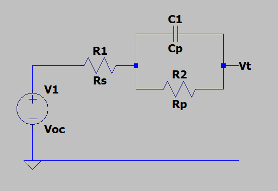

# Equivalent Cell Model


This model does not include temperature dependence of Rs, Cp, and Rp, which is the next biggest thing that will affect the accuracy of the model. Current is represented as $i$, and positive current indicates discharge.

State Vector $x$:
```math
\begin{bmatrix}SoC \\ V_p \\ R_0\end{bmatrix}$
```

a priori state estimate: $x_k=f(x_{k-1},u_k-1)+w_{k-1}$
- Where $x_{k-1}$ is the previous state, $u_{k-1}$ is the control vector, and $w_{k-1}$ is the process noise with covariance $Q_k$
```math 
f(x,i) = \begin{bmatrix}
-\frac{i}{C_{Ah}} \\
\frac{i}{C_p}-\frac{V_p}{R_pC_p} \\
0
\end{bmatrix}
```

Measurement pre-fit residual: $z_k=h(x_k)+v_k$
- Where $z_k$ is the measurement vector, $v_k$ is the observation noise with covariance $R_k$
- $h(x,i)=V_{oc}(SoC)-iR_s-V_p=V_t$

Jacobians for SoC estimation after discretization:
```math
$F_d=\frac{\delta f}{\delta x}=\begin{bmatrix}
1 & 0 & 0 \\
0 & e^{\frac{\Delta t}{R_pC_p}} & 0\\
0 & 0 & 
\end{bmatrix}$
```
```math
$H_d=\frac{\delta h}{\delta x}=\begin{bmatrix}
\frac{\delta V_{oc}}{\delta SoC} & -1 & -i
\end{bmatrix}$
```
- Where $\Delta t$ is the sample period

# Extended Kalman Filter Steps
1. Initialization
    - $\hat{x}(0|0)$ - state estimate at time step 0
    - $\hat{P}(0|0)$ - state estimation error covariance matrix at time step 0
2. Prediction
    - Project the states ahead (a priori):

        $\hat{x}(k+1|k)=f(\hat{x}(k|k),i)$
    - Project the error covariance ahead:

        $\hat{P}(k+1|k)=F_d(k)\hat{P}(k|k)F_d^T(k)+Q$
3. Correction
    - Compute the Kalman gain:
        
        $K(k+1)=\hat{P}(k+1|k)H_d^T(k)(H_d(k)\hat{P}(k+1|k)H_d^T(k)+R)^{-1}$
    - Update the estimate with the measurement $y(k)$ (a posteriori):
    
        $\hat{x}(k+1|k+1)=\hat{x}(k+1|k)+K(k+1)(V_t(k)-h(\hat{x}(k|k),i))$
    - Update the error covariance:
        
        $\hat{P}(k+1|k+1)=(I-K(k+1)H_d)\hat{P}(k+1|k)$
        - ($I$ is the identity matrix)